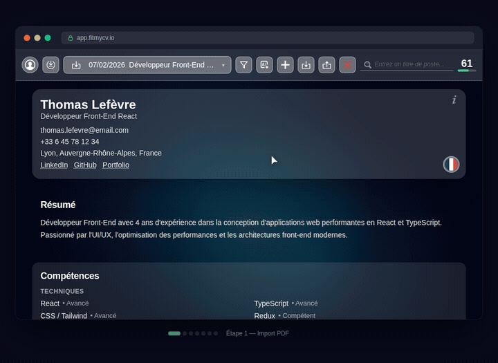

<div align="center">


# Landing Page

**Destiné au SaaS FitMyCV.io**

[](https://nextjs.org/) [](https://react.dev/) [](https://tailwindcss.com/) [](https://www.typescriptlang.org/) [](https://www.docker.com/) []()

[**Production App**](https://app.fitmycv.io)

<br />



</div>

---

## Getting Started

### Développement local (sans Docker)

```bash
npm install
npm run dev
```

Accessible sur [http://localhost:3334](http://localhost:3334) avec Turbopack hot reload.

### Docker

```bash
# Production (image optimisée ~240 MB)
docker compose up prod        # → http://localhost:3333

# Développement (hot reload)
docker compose up dev          # → http://localhost:3334

# Build production uniquement
docker compose build prod
```

---

## Structure du projet

```
src/
├── app/                    # Next.js App Router
│   └── (main)/             # Route group : layout + page
├── components/
│   └── showcase/           # Composant Showcase (mockups interactifs)
public/
├── icons/                  # Assets (logo, icônes PNG/SVG)
├── mockups/
│   ├── src/                # Sources des mockups (JS/HTML)
│   │   ├── html/           # Templates HTML, icônes, composants
│   │   └── js/             # Logique d'animation, steps 1-7
│   ├── *.bundle.js         # Bundles générés (esbuild IIFE)
│   ├── workflow-demo.html  # Démo workflow complet
│   └── step[1-7].html      # Démo de chaque étape
```

---

## Build des mockups

Les mockups sont des fichiers HTML autonomes avec CSS inline et JS bundle :

```bash
npm run build:mockups
```

Génère `workflow-demo.html` + `step1.html` à `step7.html` dans `public/mockups/`.

---

## Docker Architecture

```
┌─────────────────────────────────────────────┐
│                 Dockerfile                   │
│                                              │
│  ┌─────────┐   ┌──────┐   ┌─────────┐       │
│  │  base   │──▶│ deps │──▶│ builder │       │
│  │ alpine  │   │npm ci│   │npm build│       │
│  └─────────┘   └──────┘   └─────────┘       │
│                    │            │             │
│                    ▼            ▼             │
│               dev target   ┌────────┐        │
│              (+ volumes)   │ runner │        │
│                            │standalone│      │
│                            └────────┘        │
└─────────────────────────────────────────────┘
```

| Service | Target | Port | Usage |
|---------|--------|------|-------|
| `dev` | `deps` | 3334 | Hot reload, volumes montés |
| `prod` | `runner` | 3333 | Image standalone optimisée |

---

## Déploiement

```
Internet ──▶ Cloudflare ──▶ Caddy (TLS) ──▶ Docker :3333
                              │
         www.fitmycv.io ──────┘
         fitmycv.io ─── 301 ──▶ www.fitmycv.io
```
